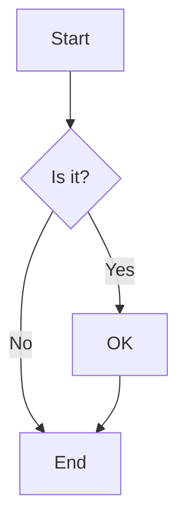
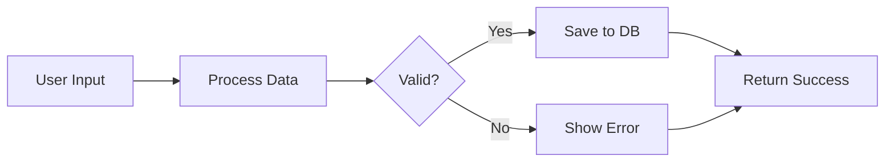
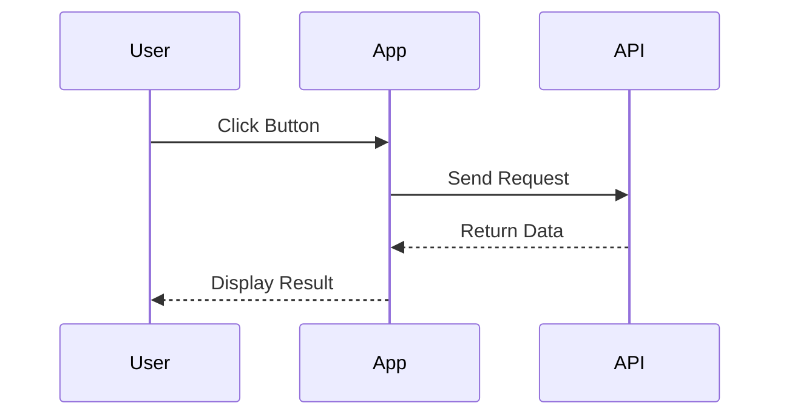
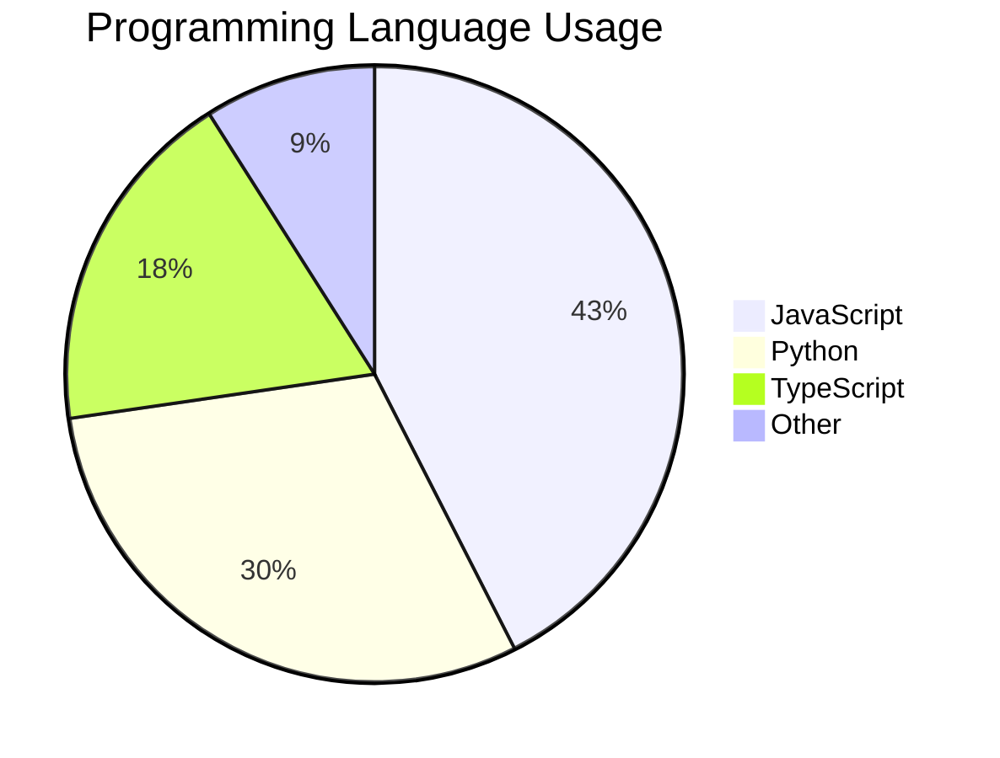
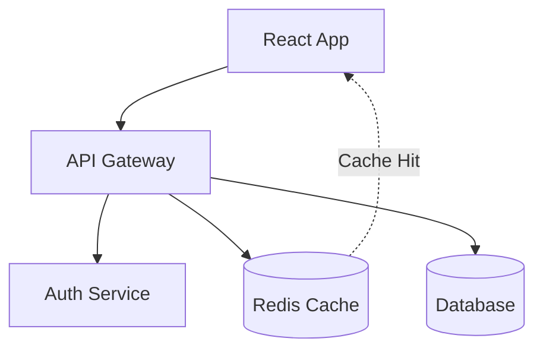

# Markdown Rendering Features

The Supernal Interface chat now supports rich markdown rendering with syntax highlighting, math equations, diagrams, and more.

## Features

### 1. **Basic Markdown**

All standard markdown features are supported:

```markdown
# Headings
## Level 2
### Level 3

**Bold text** and *italic text*

- Bullet lists
- Another item

1. Numbered lists
2. Another item

> Blockquotes
> Multi-line quotes

[Links](https://example.com)

Horizontal rules:
---
```

### 2. **GitHub Flavored Markdown (GFM)**

#### Tables

```markdown
| Column 1 | Column 2 | Column 3 |
|----------|----------|----------|
| Value 1  | Value 2  | Value 3  |
| Data A   | Data B   | Data C   |
```

#### Task Lists

```markdown
- [x] Completed task
- [ ] Incomplete task
- [ ] Another task
```

#### Strikethrough

```markdown
~~This text is crossed out~~
```

### 3. **Code Blocks with Syntax Highlighting**

Inline code: `const x = 42;`

Block code with language specification:

````markdown
```javascript
function fibonacci(n) {
  if (n <= 1) return n;
  return fibonacci(n - 1) + fibonacci(n - 2);
}
```
````

Supported languages include: javascript, typescript, python, java, go, rust, bash, sql, json, yaml, markdown, and many more.

**Features:**
- Automatic syntax highlighting
- Copy button (appears on hover)
- Line numbers
- Theme-aware (adapts to light/dark mode)

### 4. **Math Equations (KaTeX)**

Inline math: `$E = mc^2$`

Block math equations:

```markdown
$$
\frac{-b \pm \sqrt{b^2 - 4ac}}{2a}
$$
```

**Examples:**

```markdown
The quadratic formula is $x = \frac{-b \pm \sqrt{b^2-4ac}}{2a}$

For matrix multiplication:
$$
\begin{bmatrix}
a & b \\
c & d
\end{bmatrix}
\times
\begin{bmatrix}
x \\
y
\end{bmatrix}
=
\begin{bmatrix}
ax + by \\
cx + dy
\end{bmatrix}
$$
```

### 5. **Mermaid Diagrams**

Create flowcharts, sequence diagrams, and more:

````markdown

````

**Flowchart Example:**

````markdown

````

**Sequence Diagram:**

````markdown

````

**Pie Chart:**

````markdown

````

### 6. **Admonitions (Callouts)**

Create styled alert boxes using directive syntax:

```markdown
:::tip
💡 This is a helpful tip for users!
:::

:::warning
⚠️ Be careful when doing this operation.
:::

:::danger
🚨 This action cannot be undone!
:::

:::info
ℹ️ Additional information about this topic.
:::
```

**Rendered as:**
- **Tip** - Green border with light green background
- **Warning** - Yellow border with light yellow background
- **Danger** - Red border with light red background
- **Info** - Blue border with light blue background

Each admonition automatically gets an icon and theme-appropriate styling.

## Usage Examples

### In Chat Messages

AI responses automatically render markdown. Users can also send markdown-formatted messages:

**User:** "Show me a sorting algorithm"

**AI:**
````
Here's a quick sort implementation in Python:

```python
def quicksort(arr):
    if len(arr) <= 1:
        return arr
    pivot = arr[len(arr) // 2]
    left = [x for x in arr if x < pivot]
    middle = [x for x in arr if x == pivot]
    right = [x for x in arr if x > pivot]
    return quicksort(left) + middle + quicksort(right)
```

**Time Complexity:** $O(n \log n)$ average case

:::tip
Quick sort is generally faster than merge sort for small arrays due to better cache locality!
:::
````

### Architecture Diagrams

````
Here's the system architecture:


````

### Mathematical Explanations

```markdown
The gradient descent update rule is:

$$
\theta := \theta - \alpha \frac{\partial}{\partial \theta} J(\theta)
$$

Where:
- $\theta$ is the parameter vector
- $\alpha$ is the learning rate
- $J(\theta)$ is the cost function
```

## Component API

### MessageRenderer

```typescript
import { MessageRenderer } from '@supernal/interface-nextjs';

<MessageRenderer
  content="# Hello\nThis is **markdown**"
  theme="dark"
/>
```

**Props:**
- `content: string` - Markdown content to render
- `theme?: 'light' | 'dark'` - Theme mode (default: 'dark')

### CodeBlock

```typescript
import { CodeBlock } from '@supernal/interface-nextjs';

<CodeBlock
  className="language-javascript"
  theme="dark"
>
  {`const x = 42;`}
</CodeBlock>
```

**Props:**
- `children: string` - Code content
- `className?: string` - Language class (e.g., 'language-python')
- `inline?: boolean` - Render as inline code
- `theme?: 'light' | 'dark'` - Theme mode

### MermaidDiagram

```typescript
import { MermaidDiagram } from '@supernal/interface-nextjs';

<MermaidDiagram
  chart="graph TD\n  A-->B"
  theme="dark"
/>
```

**Props:**
- `chart: string` - Mermaid diagram definition
- `theme?: 'light' | 'dark'` - Theme mode

## Configuration

### Installing Dependencies

All dependencies are included with `@supernal/interface-nextjs`:

```bash
npm install @supernal/interface-nextjs
```

### Importing Styles

Markdown styles are automatically imported when you use the ChatBubble component. If using MessageRenderer standalone, import the styles:

```typescript
import '@supernal/interface-nextjs/dist/styles/markdown.css';
```

## Browser Support

- Modern browsers (Chrome, Firefox, Safari, Edge)
- Math rendering via KaTeX (works without JavaScript for static content)
- Mermaid diagrams require JavaScript
- Syntax highlighting via react-syntax-highlighter

## Performance

- Code highlighting is client-side and instant
- Mermaid diagrams render asynchronously to avoid blocking
- KaTeX math rendering is optimized for performance
- All components are lazy-loaded where possible

## Troubleshooting

### Math not rendering
Ensure KaTeX CSS is imported. It's automatically included with the MessageRenderer component.

### Mermaid diagram errors
Check the diagram syntax at [Mermaid Live Editor](https://mermaid.live/)

### Code highlighting missing
Verify the language identifier is correct (e.g., `javascript` not `js`)

### Admonitions not styled
Ensure you're using the correct syntax: `:::type` on its own line

## Examples Repository

See the [examples directory](../../examples) for complete working examples.
