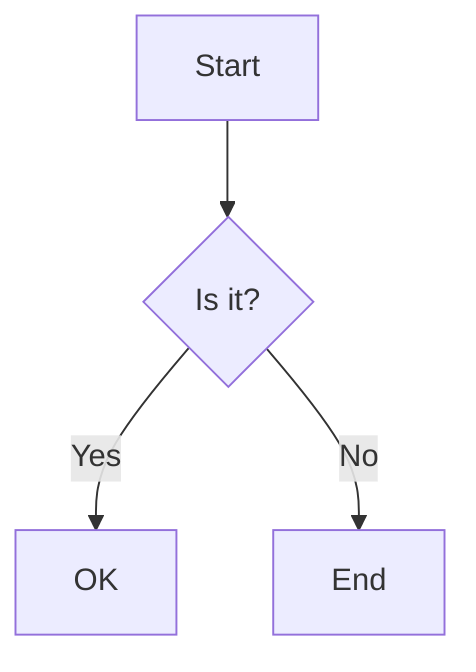

# Quick Start: Markdown Rendering Setup

## Step 1: Install Dependencies

```bash
cd /Users/ianderrington/git/supernal-nova/families/supernal-interface/open-source/interface-nextjs
npm install
```

This will install the new markdown rendering packages:
- react-markdown
- remark-gfm (GitHub Flavored Markdown)
- remark-math (Math equations)
- remark-directive (Admonitions)
- rehype-katex (Math rendering)
- react-syntax-highlighter (Code highlighting)
- mermaid (Diagrams)
- katex (Math CSS)

## Step 2: Rebuild the Package

```bash
npm run build
```

This compiles the TypeScript and bundles everything into `dist/`.

## Step 3: Clear Your Browser Cache

The old JavaScript bundle is cached in your browser. Either:

**Option A: Hard Refresh**
- Chrome/Edge: `Ctrl+Shift+R` (Windows) or `Cmd+Shift+R` (Mac)
- Firefox: `Ctrl+F5` (Windows) or `Cmd+Shift+R` (Mac)

**Option B: Clear Chat Messages**
- Click the **trash can icon** in the chat header (not a text command!)
- Or open DevTools Console and run: `localStorage.removeItem('supernal-chat-messages')`

## Step 4: Test Markdown Features

Try sending these messages in the chat:

### 1. Basic Markdown
```
**Bold text** and *italic text*

# Heading 1
## Heading 2

- Bullet list
- Another item

> This is a blockquote
```

### 2. Code Blocks
````
Here's some code:

```javascript
function hello() {
  console.log("Hello, World!");
}
```
````

### 3. Math Equations
```
The quadratic formula is: $x = \frac{-b \pm \sqrt{b^2-4ac}}{2a}$

Block equation:
$$
E = mc^2
$$
```

### 4. Mermaid Diagrams
````

````

### 5. Admonitions (Callouts)
```
:::tip
This is a helpful tip!
:::

:::warning
Be careful here!
:::

:::danger
This is dangerous!
:::
```

### 6. Tables
```
| Feature | Supported |
|---------|-----------|
| Markdown | ✅ |
| Code | ✅ |
| Math | ✅ |
| Diagrams | ✅ |
```

## Troubleshooting

### Issue: Markdown still showing as plain text

**Cause:** Browser is using cached JavaScript bundle.

**Solution:**
1. Make sure you ran `npm run build`
2. Hard refresh the page (Cmd+Shift+R or Ctrl+Shift+R)
3. Check DevTools Console for any errors

### Issue: Messages won't clear

**Cause:** You're typing "clear" as a chat message. This isn't a registered command.

**Solution:** Click the **trash can icon** in the chat header to clear messages.

### Issue: Math equations not rendering

**Cause:** KaTeX CSS might not be loading.

**Solution:** Check DevTools Console for CSS loading errors. The markdown.css file should import KaTeX styles automatically.

### Issue: Mermaid diagrams showing errors

**Cause:** Invalid Mermaid syntax.

**Solution:** Test your diagram at [https://mermaid.live/](https://mermaid.live/) first.

## How It Works

1. **MessageRenderer** component receives chat message text
2. **react-markdown** parses markdown syntax
3. **remark plugins** add GFM, math, and admonition support
4. **rehype-katex** renders math equations
5. **CodeBlock** component adds syntax highlighting
6. **MermaidDiagram** component renders diagrams
7. All styled with **markdown.css** for theme consistency

## Development Workflow

If you make changes to the markdown components:

```bash
# 1. Make your edits
# 2. Rebuild
npm run build

# 3. Test in your app
cd /path/to/your/app
npm run dev

# 4. Hard refresh browser
```

## Next Steps

- Read [MARKDOWN_FEATURES.md](./MARKDOWN_FEATURES.md) for complete feature documentation
- Check [examples/](../../examples/) for working demos
- See [package.json](./package.json) for all dependencies
